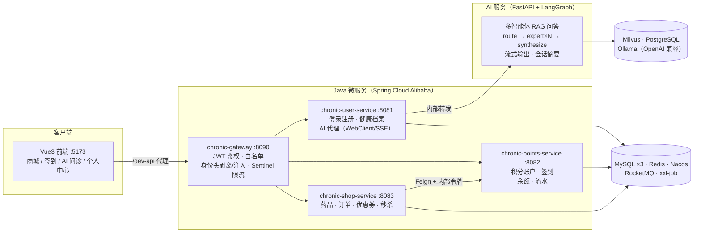

# 慢性病健康管理平台

一个「AI 健康问答 + 微服务商城」打通的慢性病健康管理平台：Python 多智能体 RAG 问诊服务负责健康问答与订单/资产查询，Spring Cloud Alibaba 微服务承载用户、积分、商城业务，Vue3 前端统一入口。

技术关键词：`FastAPI` · `LangGraph` · `Milvus` · `BGE-M3` · `Ollama` · `Spring Cloud Alibaba` · `RocketMQ` · `Redisson` · `Flyway` · `Vue3`

## 功能特性

**用户端**

- **AI 健康问答**：多智能体编排（路由 → 并行领域专家 → 整合），Milvus 混合检索 + 重排，答案可溯源到知识文档页码；真流式输出、多轮会话、滚动摘要控制上下文
- **AI 查订单/资产**：自然语言查询自己的订单与积分/余额资产，经服务间内部接口取数，取消订单只生成提案不直接执行
- **药品商城**：药品列表/详情、现金购买、积分兑换、限时秒杀（原子预扣库存防超卖）
- **优惠券**：领券用 Redisson 分布式锁 + 数据库唯一键兜底，多实例下也不会超领
- **积分与余额**：每日签到（周循环）、积分流水、余额账户、跨服务扣积分幂等
- **订单**：下单、模拟支付（本项目不接真实支付渠道）、超时未支付自动关单并归还库存/优惠券、订单取消退退款
- **账户安全**：JWT 鉴权、登出即时失效（Redis 黑名单）、登录失败防撞库锁定

**管理端**

- RBAC 角色权限、药品管理（上下架/编辑）、订单管理、秒杀活动管理
- 审计日志统一落库（跨服务读资产也强制留痕）、跨服务补偿任务台账与指数退避重试

## 系统架构



- **请求链路**：前端所有请求经网关统一鉴权后转发；网关剥离客户端伪造的身份头，注入可信的 `X-User-Id`，下游服务只信任网关。
- **服务间调用**：积分加减/退款等内部接口不经网关暴露，仅 Feign + `X-Internal-Token` 拦截器互通；调用失败写补偿台账，定时任务指数退避重试。
- **数据一致性**：跨服务扣积分用「本地事务 + 流水唯一键幂等 + 乐观锁」；订单支付状态机原子推进，重复回调只生效一次；RocketMQ 在事务提交后才发事件，超时关单由延迟消息 + 定时兜底双保险。
- **AI 链路**：前端不直连 AI 服务，由 user-service 以 WebClient/SSE 转发；会话 checkpoint 持久化到 PostgreSQL，故障自动降级内存并在恢复后补写。

## 技术栈

| 层 | 技术 |
| --- | --- |
| 前端 | Vue 3.4 · Vite 5 · Pinia · Element Plus · Vitest |
| 微服务 | Java 17 · Spring Boot 3.3.13 · Spring Cloud 2023.0.6 · Spring Cloud Alibaba 2023.0.3.4（Gateway/Nacos/Sentinel）· OpenFeign · MyBatis-Plus · Flyway · Redisson |
| AI 服务 | Python 3.10 · FastAPI · LangGraph · Milvus 混合检索 · BGE-M3 + Reranker · Ollama（默认 qwen2.5:7b）· PostgreSQL |
| 中间件 | MySQL · Redis · Nacos · RocketMQ · xxl-job · 阿里云 OSS（可选，未配置不影响其余功能） |
| 工程 | Maven 多模块 · Knife4j 接口文档 · Actuator/Prometheus 指标 · 全链路 Trace-Id |

## 项目结构

```
├── chronic_disease/                # AI 服务：FastAPI + LangGraph 多智能体 RAG 问答（含知识入库脚本）
├── chronic_disease-microservices/  # 微服务端：网关 + 用户/积分/商城三个服务 + SQL 初始化脚本
├── chronic_disease_vue/            # 前端：商城、签到、优惠券、订单、AI 问诊、管理端
└── deploy/nacos/                   # Nacos 配置（9 个 dataId，敏感项走环境变量）
```

各子项目有独立的 README，包含更细的模块说明与设计要点：
[chronic_disease](./chronic_disease/README.md) · [chronic_disease-microservices](./chronic_disease-microservices/README.md) · [chronic_disease_vue](./chronic_disease_vue/README.md)

## 快速开始

环境要求：JDK 17、Maven 3.8+、Node 18+、Python 3.10；中间件：MySQL、Redis、Nacos、RocketMQ、xxl-job（AI 服务另需 Milvus、PostgreSQL、Ollama）。

```bash
# 1) 建库（user / points / shop 三库；表结构和种子数据由 Flyway 在服务首次启动时自动迁移）
mysql -h<HOST> -P3307 -uroot -p < chronic_disease-microservices/sql/init.sql

# 2) 导入 Nacos 配置：把 deploy/nacos/*.yaml 发布到 Nacos（DEFAULT_GROUP），
#    其中的 ${JWT_SECRET}/${MYSQL_PASSWORD} 等占位项用环境变量或发布前替换填入

# 3) 构建并启动四个 Java 服务（需 Nacos/Redis/MySQL 可达）
cd chronic_disease-microservices
mvn package -DskipTests
java -Dfile.encoding=UTF-8 -jar chronic-gateway/target/chronic-gateway-1.0.0-SNAPSHOT.jar             # 8090
java -Dfile.encoding=UTF-8 -jar chronic-user-service/target/chronic-user-service-1.0.0-SNAPSHOT.jar   # 8081
java -Dfile.encoding=UTF-8 -jar chronic-points-service/target/chronic-points-service-1.0.0-SNAPSHOT.jar # 8082
java -Dfile.encoding=UTF-8 -jar chronic-shop-service/target/chronic-shop-service-1.0.0-SNAPSHOT.jar   # 8083

# 4) 启动前端（开发代理 /dev-api → 网关 8090）
cd ../chronic_disease_vue
npm install
npm run dev        # http://localhost:5173（后端未连接时自动降级为演示数据）

# 5)（可选）启动 AI 服务：需先准备好 Milvus 集合与 Ollama
cd ../chronic_disease
pip install -r requirements.txt
cp config.ini.example config.ini   # 按环境修改 Milvus/模型/PostgreSQL 配置
python app.py                      # :8001，自带演示页
```

种子账号：`admin / 123456`（预置 500 积分）。前端在后端不可达时会自动切换演示模式，因此不启动任何后端也能完整浏览界面。

## 接口文档

各 Servlet 服务内置 Knife4j，服务启动后访问 `http://localhost:<端口>/doc.html` 查看。
